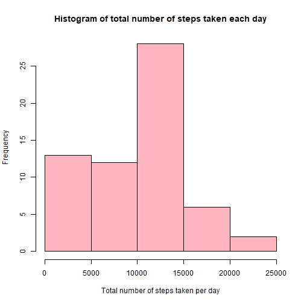
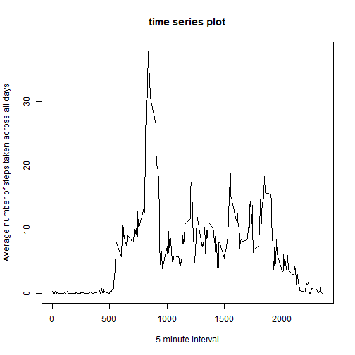
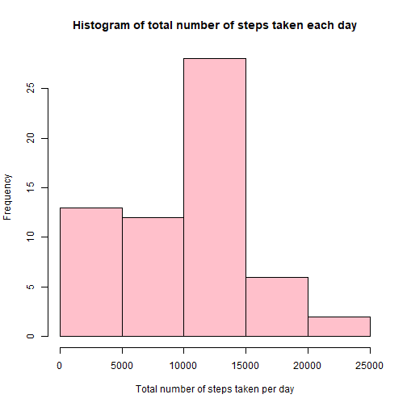
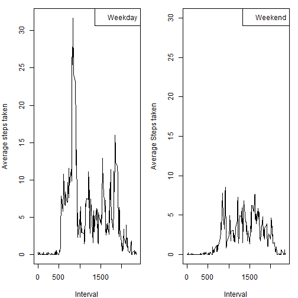

# Course Project 1 (Reproducible Research)
## Submitted by Kritika Gulati

### 1. Loading and Preprocessing the data

* Loading the data
* Processing/transforming the data into a format suitable for analysis


```r
x<-read.csv("activity.csv", header=TRUE, sep = ",")
x$date<-as.Date(x$date)
```

### 2. What is the mean total number of steps taken per day?

* Calculating the total number of steps per day


```r
y<-NULL
for (i in 1:length(unique(x$date))) {
  d1<-subset(x, x$date==unique(x$date)[i])
  y[i]<-sum(d1$steps, na.rm = TRUE)
}
d2<-data.frame(date=unique(x$date), Steps=y)
d2
```

```
##          date Steps
## 1  2012-10-01     0
## 2  2012-10-02   126
## 3  2012-10-03 11352
## 4  2012-10-04 12116
## 5  2012-10-05 13294
## 6  2012-10-06 15420
## 7  2012-10-07 11015
## 8  2012-10-08     0
## 9  2012-10-09 12811
## 10 2012-10-10  9900
## 11 2012-10-11 10304
## 12 2012-10-12 17382
## 13 2012-10-13 12426
## 14 2012-10-14 15098
## 15 2012-10-15 10139
## 16 2012-10-16 15084
## 17 2012-10-17 13452
## 18 2012-10-18 10056
## 19 2012-10-19 11829
## 20 2012-10-20 10395
## 21 2012-10-21  8821
## 22 2012-10-22 13460
## 23 2012-10-23  8918
## 24 2012-10-24  8355
## 25 2012-10-25  2492
## 26 2012-10-26  6778
## 27 2012-10-27 10119
## 28 2012-10-28 11458
## 29 2012-10-29  5018
## 30 2012-10-30  9819
## 31 2012-10-31 15414
## 32 2012-11-01     0
## 33 2012-11-02 10600
## 34 2012-11-03 10571
## 35 2012-11-04     0
## 36 2012-11-05 10439
## 37 2012-11-06  8334
## 38 2012-11-07 12883
## 39 2012-11-08  3219
## 40 2012-11-09     0
## 41 2012-11-10     0
## 42 2012-11-11 12608
## 43 2012-11-12 10765
## 44 2012-11-13  7336
## 45 2012-11-14     0
## 46 2012-11-15    41
## 47 2012-11-16  5441
## 48 2012-11-17 14339
## 49 2012-11-18 15110
## 50 2012-11-19  8841
## 51 2012-11-20  4472
## 52 2012-11-21 12787
## 53 2012-11-22 20427
## 54 2012-11-23 21194
## 55 2012-11-24 14478
## 56 2012-11-25 11834
## 57 2012-11-26 11162
## 58 2012-11-27 13646
## 59 2012-11-28 10183
## 60 2012-11-29  7047
## 61 2012-11-30     0
```

* Histogram of the total number of steps taken each day


```r
hist(d2$Steps, xlab = "Total number of steps taken per day", 
     main = "Histogram of total number of steps taken each day", 
     col = "light pink")
```




* The mean and median of the total number of steps taken per day


```r
print(paste("Mean of the total number of steps taken per day:", mean(y)))
```

```
## [1] "Mean of the total number of steps taken per day: 9354.22950819672"
```

```r
print(paste("Median of the total number of steps taken per day:", median(y)))
```

```
## [1] "Median of the total number of steps taken per day: 10395"
```

### 3. Average daily activity pattern

* Time series plot of the 5-minute interval (x-axis) and the average number of steps taken, averaged across all days (y-axis)


```r
y<-0
a<-NULL
a1<-nrow(subset(x,x$date==unique(x$date)[1]))
for (i in 1:a1) {
  j<-i
  while (j<=nrow(x)){
    y[i]<-sum(y[i], x$steps[j], na.rm = TRUE)
  j<-j+a1 }
  a[i]<-y[i]/a1
}

plot(unique(x$interval), a, type = "l", xlab = "5 minute Interval", 
     ylab = "Average number of steps taken across all days", 
     main = "time series plot")
```



* Which 5-minute interval, on average across all the days in the dataset, contains the maximum number of steps?


```r
res1<-which(a==max(a))
res3<-unique(x$interval)[res1]
res2<-max(a)
```

Hence, 835 is the 5-minute interval that contains the maximum number 
of steps, 37.9409722 on average.

### 4. Imputing missing values

* Calculating the total number of missing values in the dataset (i.e total
number of rows with NAs)


```r
k<-0
for(i in 1:nrow(x)){
  if(is.na(x$steps[i])==TRUE)
    k<-k+1
}
```

There are 2304 missing values in the dataset. 

* A strategy for filling in the missing values in the dataset.
We will be filling in the missing values for a particular day in the dataset with the mean of the number of steps taken in that day.

*  A new dataset that is equal to the original dataset but with the missing data filled in


```r
y<-NULL
x1<-x
for (i in 1:length(unique(x1$date))) {
  d1<-subset(x1, x1$date==unique(x1$date)[i])
  y[i]<-mean(d1$steps, na.rm = TRUE)
}
m<-which(is.nan(y)==TRUE)
for (i in m) {
  y[i]<-0
}
i<-1
j<-1
while (i<=nrow(x1)) { 
    for (k in 1:a1) {
      if(is.na(x1$steps[k+i-1])==TRUE)
        x1$steps[k+i-1]<-y[j]
    }
  j<-j+1
   i<-i+a1 
}
```

*  Histogram of the total number of steps taken each day with mean and median total number of steps taken per day


```r
y<-NULL
for (i in 1:length(unique(x1$date))) {
  d1<-subset(x1, x1$date==unique(x1$date)[i])
  y[i]<-sum(d1$steps)
}
d2<-data.frame(date=unique(x1$date), Steps=y)

hist(d2$Steps, xlab = "Total number of steps taken per day", 
     main = "Histogram of total number of steps taken each day", 
     col = "pink")
```



```r
print(paste("Mean of the total number of steps taken per day:", mean(y)))
```

```
## [1] "Mean of the total number of steps taken per day: 9354.22950819672"
```

```r
print(paste("Median of the total number of steps taken per day:", median(y)))
```

```
## [1] "Median of the total number of steps taken per day: 10395"
```

Hence, we see that the mean and median values stay the same as the first part of the assignment. Hence, there is no impact of imputing missing values in the dataset. 

### 5. Are there differences in activity patterns between weekdays and weekends?

* Create a new factor variable in the dataset with two levels – “weekday” and “weekend” indicating whether a given date is a weekday or weekend day.


```r
x1<-cbind(x1, day=weekdays(x1$date))
for(i in 1:nrow(x)){
  if(x1$day[i]=="Saturday" | x1$day[i]=="Sunday")
    x1$day[i]<-"weekend"
  else
    x1$day[i]<-"weekday"
}
x1$day<-as.factor(x1$day)
```

* A panel plot containing a time series plot of the 5-minute interval (x-axis) and the average number of steps taken, averaged across all weekday days or weekend days (y-axis).


```r
x2<-subset(x1, x1$day=="weekday")
y<-0
a2<-NULL
a1<-nrow(subset(x2,x2$date==unique(x2$date)[1]))
for (i in 1:a1) {
  j<-i
  while (j<=nrow(x2)){
    y[i]<-sum(y[i], x2$steps[j], na.rm = TRUE)
    j<-j+a1 }
  a2[i]<-y[i]/a1
}
x3<-subset(x1, x1$day=="weekend")
y<-0
a3<-NULL
a1<-nrow(subset(x3,x3$date==unique(x3$date)[1]))
for (i in 1:a1) {
  j<-i
  while (j<=nrow(x3)){
    y[i]<-sum(y[i], x3$steps[j], na.rm = TRUE)
    j<-j+a1 }
  a3[i]<-y[i]/a1
}
par(mfcol=c(1,2), mar=c(4,4,1,1))
plot(unique(x1$interval), a2, type="l", xlab ="Interval", 
     ylab="Average steps taken")
legend("topright", legend = "Weekday")
plot(unique(x1$interval), a3, type="l", ylim = c(0,30), xlab = "Interval",
     ylab = "Average Steps taken")
legend("topright", legend="Weekend")
```



